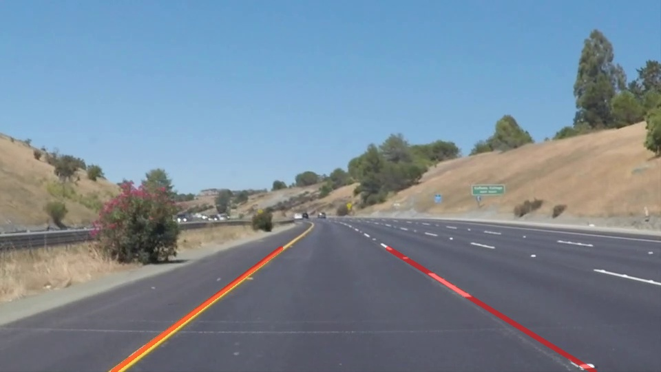
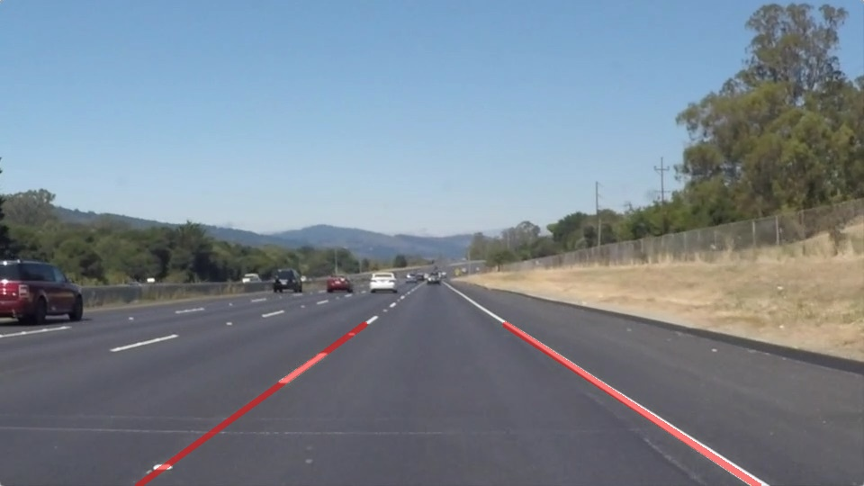

# **Finding Lane Lines on the Road** 

Overview
---

"When we drive, we use our eyes to decide where to go.  The lines on the road that show us where the lanes are act as our constant reference for where to steer the vehicle.  Naturally, one of the first things we would like to do in developing a self-driving car is to automatically detect lane lines using an algorithm."

In this project I detected lane lines in images using Python and OpenCV. The code can be found and executed in the Jupyter Notebook `P1.ipynb`. The output videos can be found in the `test_videos_output` folder.

Pipeline
---
There are 5 steps in the pipeline that I created to detect lane lines.
1. Convert the image to grayscale
2. Apply Canny Edge Detection with a Gausian Blur
3. Perform a Hough Transform to extract the lines from the edge image
4. Average the lines together and form a single line for each lane line that extrapolates out from them
5. Overlay these lines on each image in the video

